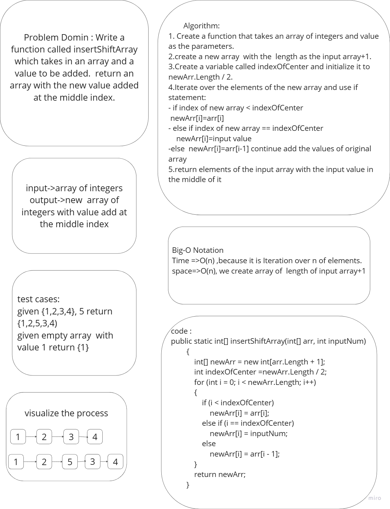

# Challenege 02 - array-insert-shift

Take an array and value return the array with value in the middle of it

## Whiteboard Process

## Solution 

[Solution](../data-structures-and-algorithms/CC02.cs)

## Unit test code

[test code](../CodeChallengesTests/test02.cs)

---

## Stretch Goal

Write a second function that removes an element from the middle index and shifts other elements in the array to fill the new gap.

## Whiteboard Process

## Solution code

[Solution](../data-structures-and-algorithms/CC02.cs)

## Unit test code

[test code](../CodeChallengesTests/test02.cs)

