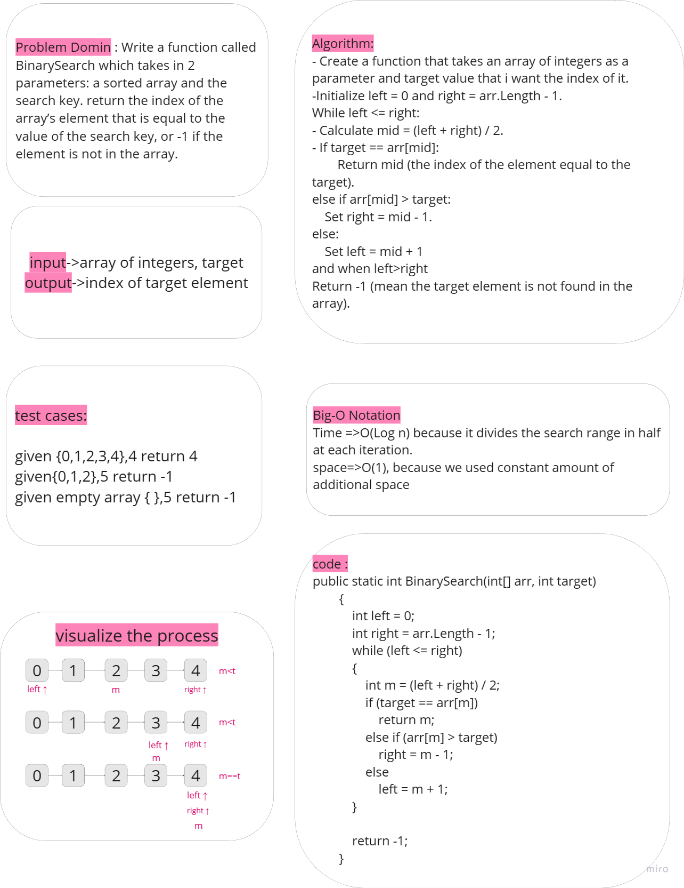

# Challenege 03 - BinarySearch

Take an array and target value return the index of that target value

## Whiteboard Process

## Solution

[Solution](../data-structures-and-algorithms/CC03.cs)

## Unit test code

[test code](../CodeChallengesTests/test03.cs)
