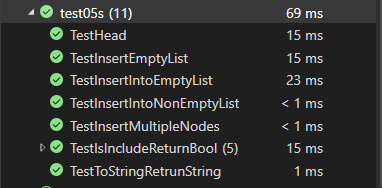

# Single Linked List Implementation

This code provides an implementation of a linked list data structure in C#. It includes functionality to insert nodes at the beginning and end of the list, check if a value exists in the list, and obtain a string representation of the list.

## Functions

### `public bool IsEmpty()`

Checks if the list is empty.

- Returns: `true` if the list is empty, `false` otherwise.

### `public void InsertEnd(int el)`

Inserts a new node with the given value at the end of the list.

- Arguments:
  - `el` (int): Value to be inserted.

### `public void InsertFirst(int el)`

Inserts a new node with the given value at the beginning of the list.

- Arguments:
  - `el` (int): Value to be inserted.

### `public bool IsInclude(int el)`

Checks if the list includes a node with the given value.

- Arguments:
  - `el` (int): Value to search for.
- Returns: `true` if the value is found, `false` otherwise.

### `public override string ToString()`

Returns a string representation of the values in the linked list.

- Returns: String representation of the linked list values, formatted as "{ value } -> { value } -> ... -> Null".

### [Source Code](../data-structures-and-algorithms/CC05.cs)

### Unit tests

Tests are written to demonstrate the following functionality:

1. Can successfully instantiate an empty linked list
2. Can properly insert into the linked list
3. The head property will properly point to the first node in the linked list
4. Can properly insert multiple nodes into the linked list
5. Will return true when finding a value within the linked list that exists
6. Will return false when searching for a value in the linked list that does not exist
7. Can properly return a collection of all the values that exist in the linked list

### [Unit Tests Code](../CodeChallengesTests/test05s.cs)

