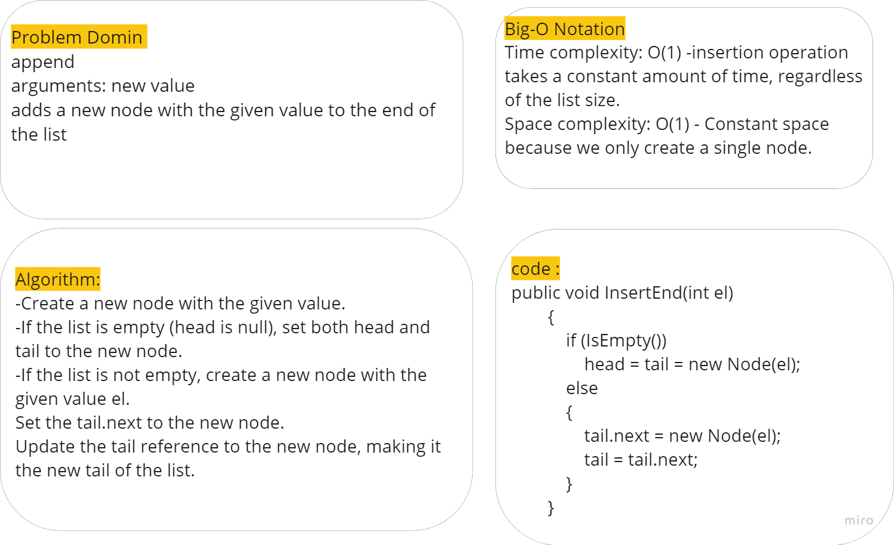
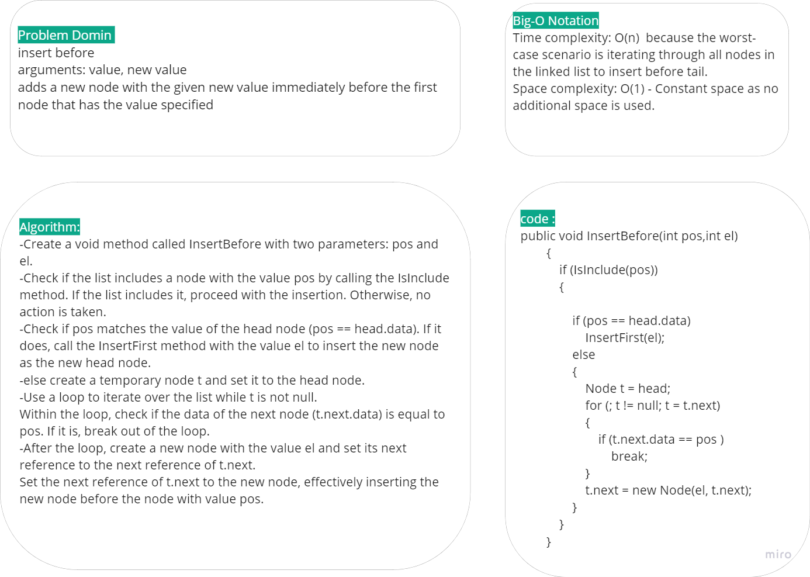
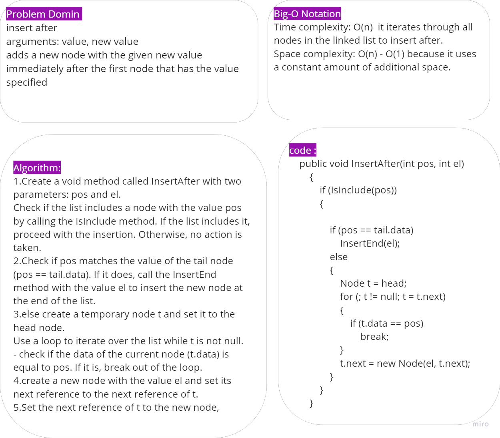
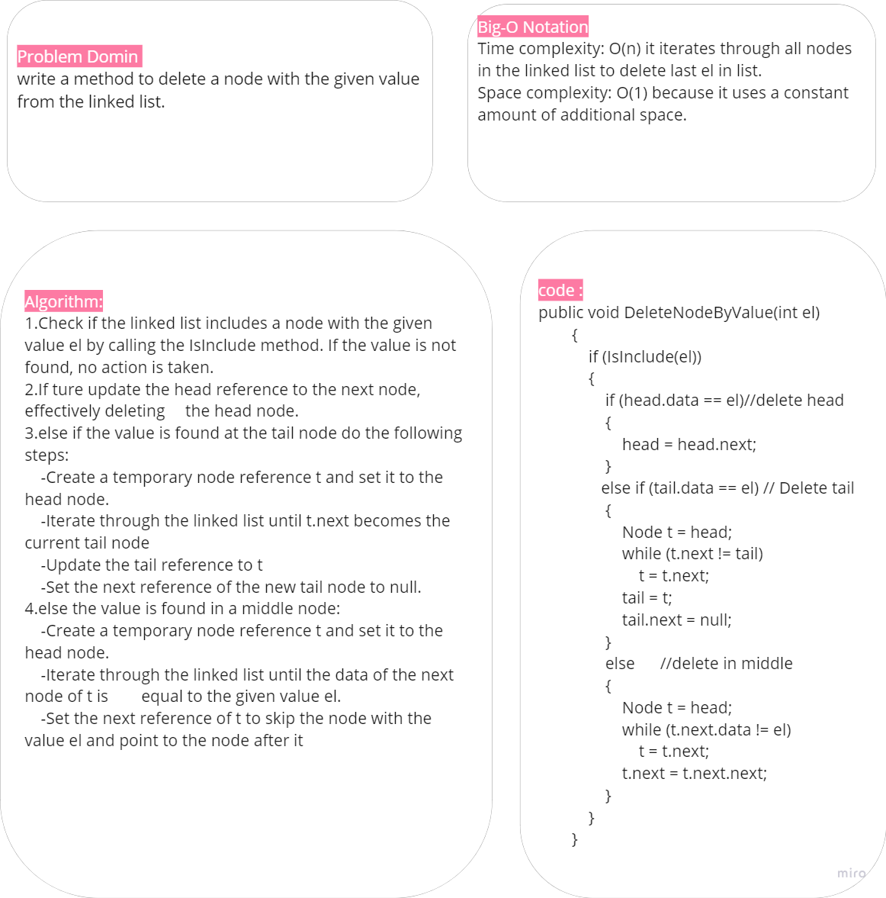
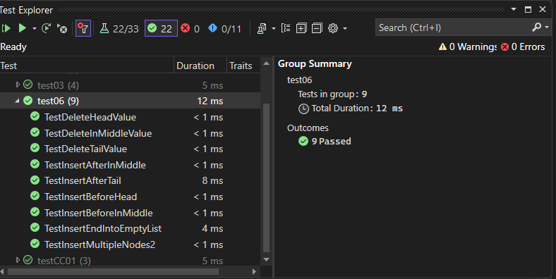

# Single Linked List Implementation

This code provides an implementation of a linked list data structure in C#. It includes functionality to insert nodes before node, after it and at the end of the list.And delete node from the list.

## WhiteBoard

**Append**

**Insert before**

**Insert After**

# Stretch Goal

## [Source Code](../data-structures-and-algorithms/CC06.cs)

### Unit tests

Tests are written to demonstrate the following functionality:

1. Can successfully add a node to the end of the linked list
2. Can successfully add multiple nodes to the end of a linked list
3. Can successfully insert a node before a node located i the middle of a linked list
4. Can successfully insert a node before the first node of a linked list
5. Can successfully insert after a node in the middle of the linked list
6. Can successfully insert a node after the last node of the linked list
7. Test delete method

## [Unit Tests Code](../CodeChallengesTests/test06.cs)

