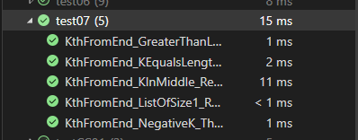

# linked-list-kth

The `kthFromEnd` method is designed to find the value of a node that is `k` positions away from the tail of a linked list. It handles different scenarios and exceptions, including:

1. If the linked list is empty, it throws an `InvalidOperationException` with a message indicating that the operation cannot be performed on an empty list.

2. If `k` is a negative integer, it throws an `ArgumentException` with a message indicating that `k` must be a non-negative integer.

3. It determines the size of the linked list using the `Size` method.

4. If `k` exceeds the length of the list, it throws an `ArgumentException` with a message indicating that `k` exceeds the length of the list.

5. If `k` is within a valid range, it iterates through the list to find the node at the target index.

6. Once the target index is reached, it returns the value of the node, indicating the value of the node `k` index from the end of the list.

## [Code](../data-structures-and-algorithms/CC07.cs)

```charp
 public int kthFromEnd(int k)
        {
            if (IsEmpty())
            {
                throw new InvalidOperationException("Cannot perform kthFromEnd operation on an empty linked list.");
            }
            if (k < 0)
            {
                throw new ArgumentException("Invalid value of k. k must be a non-negative integer.");
            }

            int size = Size();
            if (k >= size)
            {
                throw new ArgumentException("Invalid value of k. k exceeds the length of the list.");
            }
            Node t = head;
            int i = 1;
            int targetIndex = size - k;

            while (i < targetIndex)
            {
                t = t.next;
                i++;
            }
            return t.data;
        }

 ```

## [Unit Testing](../CodeChallengesTests/test07.cs)

The testing written to test these cases:

1. Where k is greater than the length of the linked list
2. Where k and the length of the list are the same
3. Where k is not a positive integer
4. Where the linked list is of a size 1
5. “Happy Path” where k is not at the end, but somewhere in the middle of the linked list


