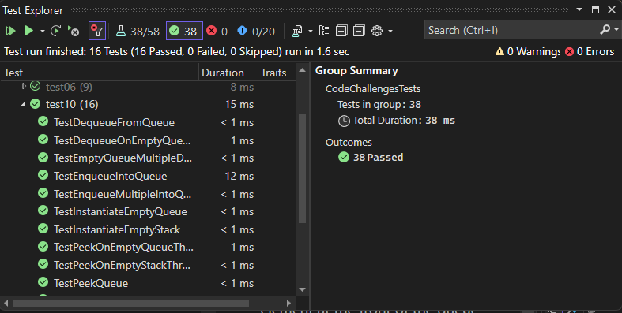

# Stack and Queue Implementation using Linked List

This code includes an implementation of a Stack and a Queue data structure using a Linked List as the underlying data storage mechanism. The Stack and Queue classes provide methods for performing common operations on these data structures.

## Stack

The Stack class represents a (FILO) data structure. It supports the following methods:

- `Push(el)`:add to the top of the stack.
- `Pop()`: remove and returns the element from the top of the stack.
- `Peek()`: returns the value of the element at the top of the stack without removing it.
- `IsEmpty()`: returns a boolean whether the stack is empty or not.

## Queue

The Queue class represents a (FIFO) data structure. It provides the following methods:

- `Enqueue(el)`: adds to the back of the queue.
- `Dequeue()`: removes and returns the element from the front of the queue.
- `Peek()`: returns the value of the element at the front of the queue without removing it.
- `IsEmpty()`: returns a boolean whether the queue is empty or not.

## [Code](../data-structures-and-algorithms/CC10.cs)

## [Unit Testing](../CodeChallengesTests/test10.cs)

### Testing

The testing written to test that code works correctly:

- **Stack tests**:
  - Can successfully push onto a stack.
  - Can successfully push multiple values onto a stack.
  - Can successfully pop off the stack.
  - Can successfully empty a stack after multiple pops.
  - Can successfully peek the next item on the stack.
  - Can successfully instantiate an empty stack.
  - Calling pop or peek on an empty stack raises an exception.

- **Queue tests**:
  - Can successfully enqueue into a queue.
  - Can successfully enqueue multiple values into a queue.
  - Can successfully dequeue out of a queue the expected value.
  - Can successfully peek into a queue, seeing the expected value.
  - Can successfully empty a queue after multiple dequeues.
  - Can successfully instantiate an empty queue.
  - Calling dequeue or peek on an empty queue raises an exception.

