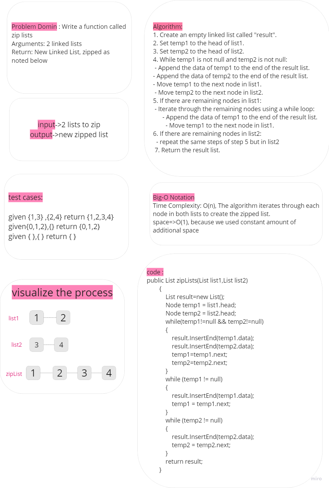
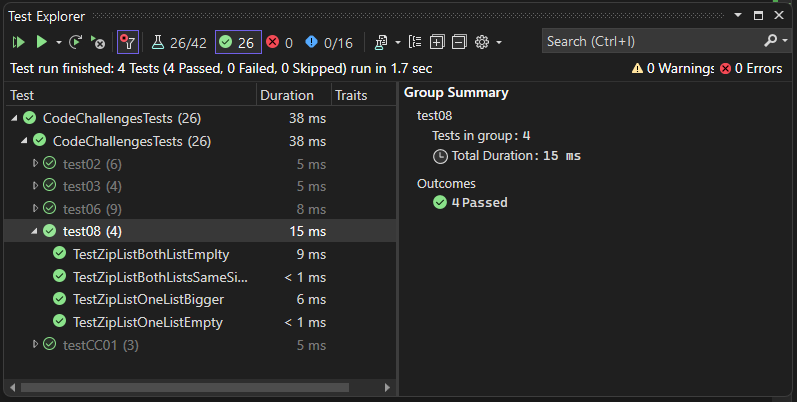

# linked-list-zip

The `zipLists` function is a method implemented in the `List` class that allows merging two linked lists, `list1` and `list2`, into a new linked list. The resulting list, called `result`, is created by alternating elements from `list1` and `list2` in a specific pattern.

## Whitboard 

## [Code](../data-structures-and-algorithms/CC08.cs)

## [Unit Testing](../CodeChallengesTests/test08.cs)

The testing written to test these cases:

1.  Test case for when both lists are empty
2. Test case for when one list is empty
3. Test case for when both lists have the same size
4. Test case for when one list is bigger than the other

