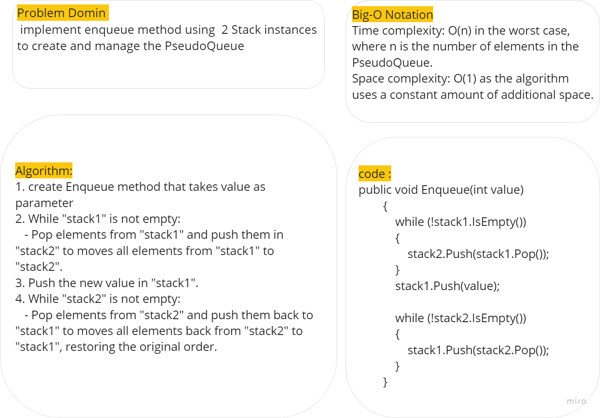
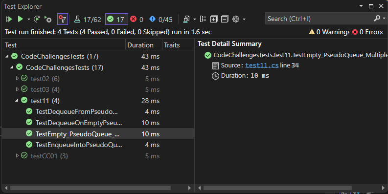

# Stack Queue Pseudo

This code provided implements a PseudoQueue class that simulates a queue data structure using two stacks. The PseudoQueue class provides methods for enqueueing and dequeuingis.
## Whitboard 

### Enqueue

### Deueue

## [Code](../data-structures-and-algorithms/CC11.cs)

## [Unit Testing](../CodeChallengesTests/test11.cs)

The testing written to test these cases:

  - Can successfully enqueue into a queue.
  - Can successfully enqueue multiple values into a PseudoQueue.
  - Can successfully dequeue out of a PseudoQueue the expected value.
  - Can successfully empty a queue after multiple dequeues.

