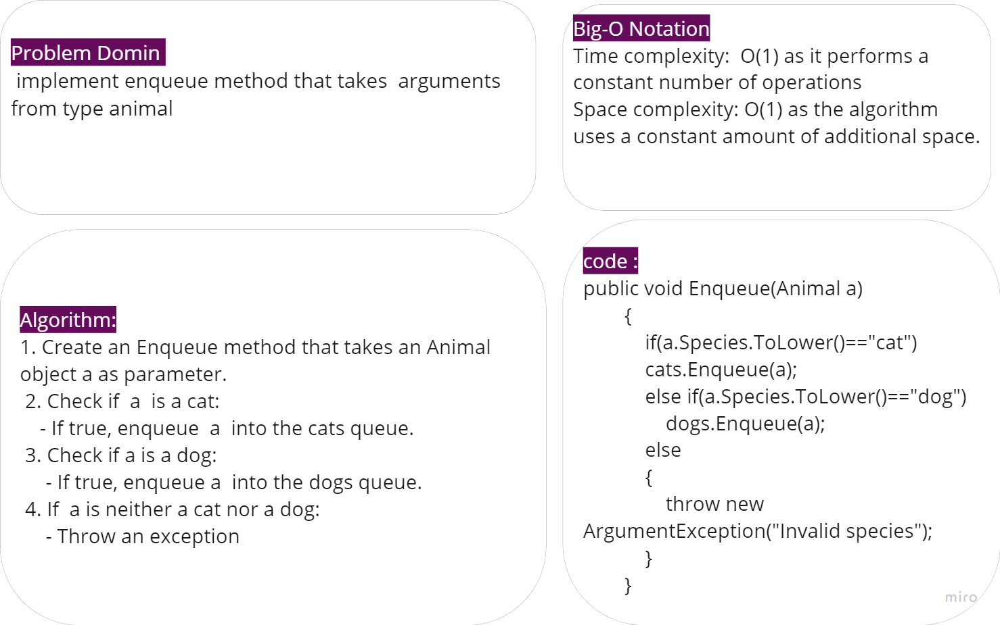
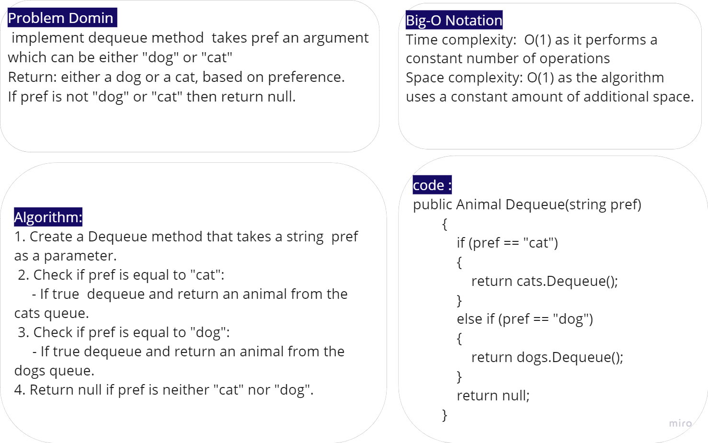
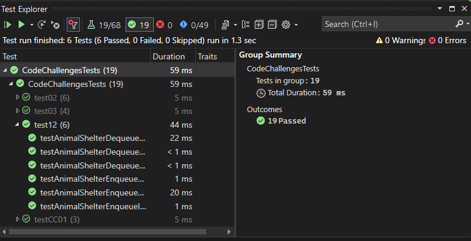

# Stack Queue shelter

The code implement `AnimalShelter` class represents a shelter that holds dogs and cats in a first-in, first-out manner.

## Whitboard 

### Enqueue

### Deueue

## [Code](../data-structures-and-algorithms/CC12.cs)

## [Unit Testing](../CodeChallengesTests/test12.cs)

The testing written to test these cases:

- Can successfully enqueue a dog or cat into the shelter.
- Can successfully dequeue a cat or dog from the shelter based on preference.
- Can successfully handle dequeuing when the preference is not "cat" or "dog"
- Can successfully handle dequeuing when the preference is for a species other than dog or cat.

