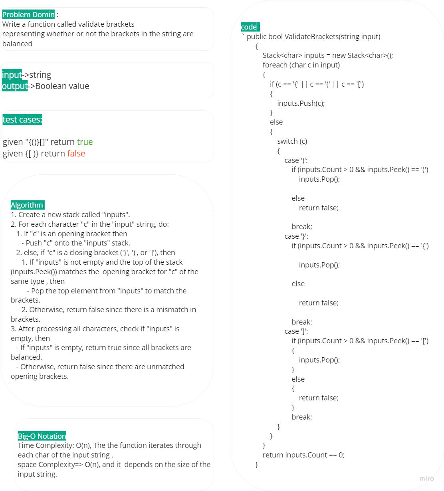
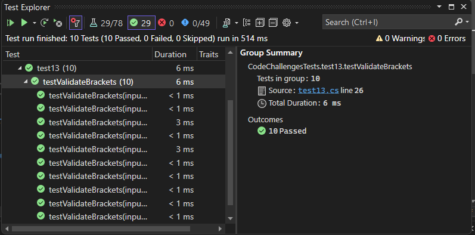

# Stack Queue brackets

The code implement `ValidateBrackets` method that checks whether the brackets in a given input string are balanced or not. 

## Whitboard 

## [Code](../data-structures-and-algorithms/CC13.cs)

## [Unit Testing](../CodeChallengesTests/test13.cs)

The testing written to test several cases ,some of them:

- Test Case: Balanced Brackets
	* Input: `"{}"`			
	* Expected Output: True
	
- Test Case: Nested Brackets				
	* Input: `"()[[Extra Characters]]"`
	* Expected Output: True
	
- Test Case: Unbalanced Brackets - Mismatched Pairs		
	- Input: `"[({}]"`
	- Expected Output: False
- Test Case: Unbalanced Brackets - Mismatched Nested Brackets		
	- Input: `"{(})"`
	- Expected Output: False

