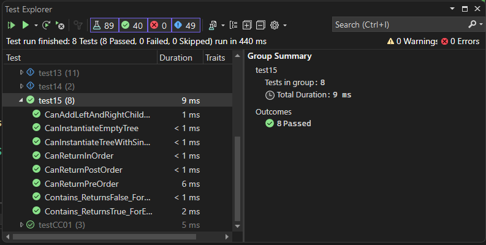

# Trees 

This code provides a basic implementation of a Binary Tree and a Binary Search Tree (BST) with methods for Pre-order, In-order, and Post-order traversals, as well as insertion and search functionalities

## Whitboard 

### Binary Tree

- **For the rest of traversal methods (in order and post order )thay are the same as pre order in change where append the root in the list**

### Binary Search Tree

- add 

- Contains 

## [Code](../data-structures-and-algorithms/CC15.cs)

## [Unit Testing](../CodeChallengesTests/test15.cs)

The testing written to test several cases:

1. Can successfully instantiate an empty tree
2. Can successfully instantiate a tree with a single root node
3. For a Binary Search Tree, can successfully add a left child and right child properly to a node
4. Can successfully return a collection from a pre-order traversal
5. Can successfully return a collection from an in-order traversal
6. Can successfully return a collection from a post-order traversal
7. Returns true	false for the contains method, given an existing or non-existing node value

