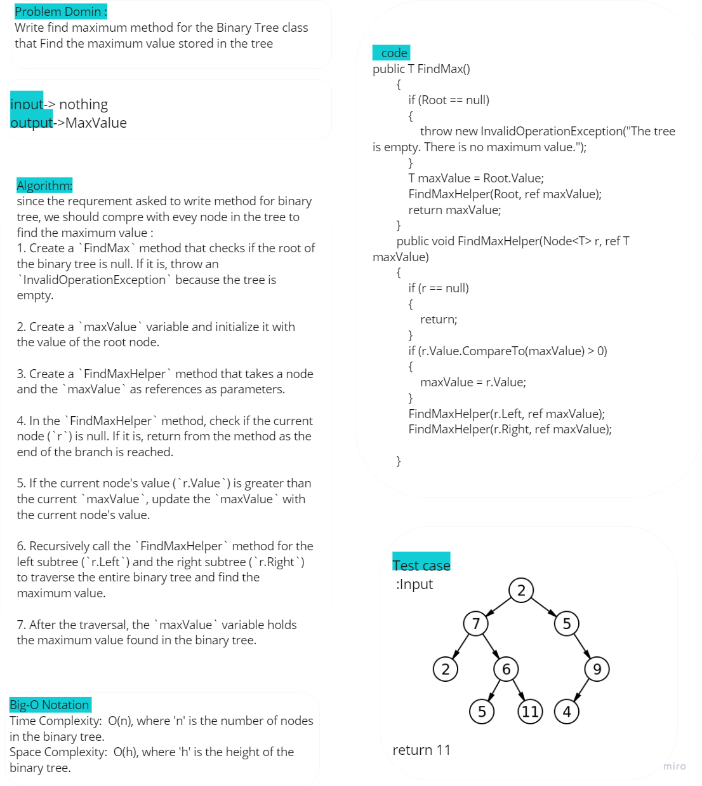

# Trees Max 

this code was implemente FinMax mehtod that Finds the maximum value in the binary tree and returns it.

## Whitboard 




## [Code](../data-structures-and-algorithms/CC15.cs)


```csharp
public T FindMax()
{
    if (Root == null)
    {
        throw new InvalidOperationException("The tree is empty. There is no maximum value.");
    }
    T maxValue = Root.Value;
    FindMaxHelper(Root, ref maxValue);
    return maxValue;
}

public void FindMaxHelper(Node<T> r, ref T maxValue)
{
    if (r == null)
    {
        return;
    }
    if (r.Value.CompareTo(maxValue) > 0)
    {
        maxValue = r.Value;
    }
    FindMaxHelper(r.Left, ref maxValue);
    FindMaxHelper(r.Right, ref maxValue);
}
```

## [Unit Testing](../CodeChallengesTests/test16.cs)

The testing written to test several cases:

1. Can successfully find maximun value in binary tree
2. It ensures that the method correctly throws an exception when attempting to find the maximum value in an empty tree.


