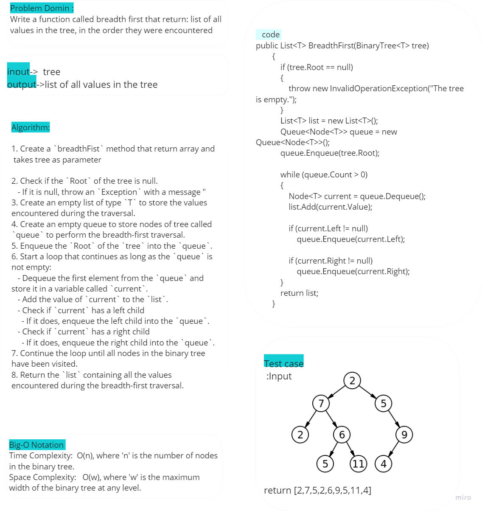
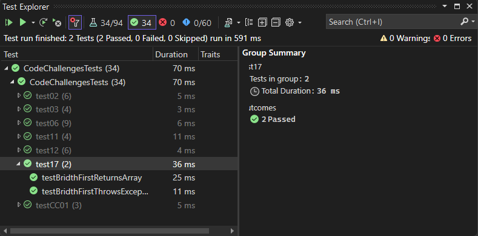

# Trees breadth first

this code implements The BreadthFirst method that performs a breadth-first traversal on a binary tree, returning a list of all values encountered in the order they were visited.

## Whitboard 

## [Code](../data-structures-and-algorithms/CC17.cs)

## [Unit Testing](../CodeChallengesTests/test17.cs)

The test cases are as follows:

1. Can successfully return an array of values in a binary tree.
2. It ensures that the method correctly throws an exception when attempting to traverse an empty tree.

