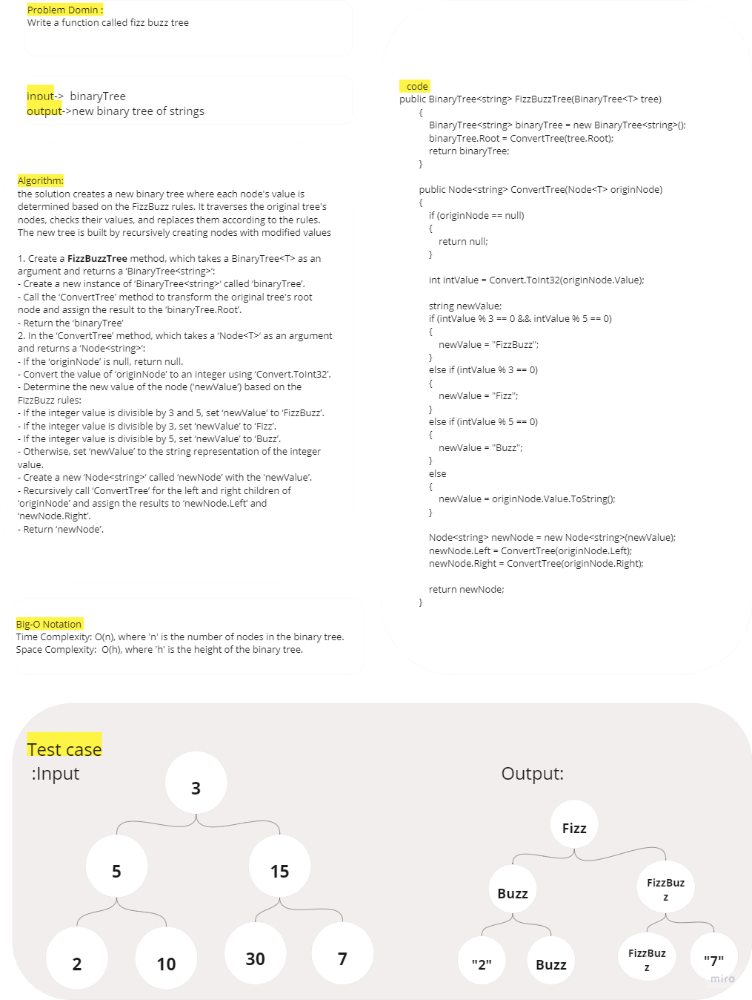
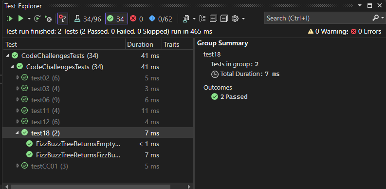

# Tree Fizz Buzz

This code implements FizzBuzzTree method which takes a binary tree as input and returns a new binary tree with values transformed according to FizzBuzz rules. 

## Whitboard 

## [Code](../data-structures-and-algorithms/CC18.cs)

## [Unit Testing](../CodeChallengesTests/test18.cs)

The test cases are as follows:

1. Can successfully transformation of a binary tree's values according to FizzBuzz rules.
2. Ensures correct handling of an empty input binary tree.

