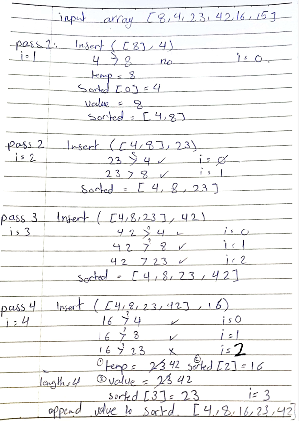
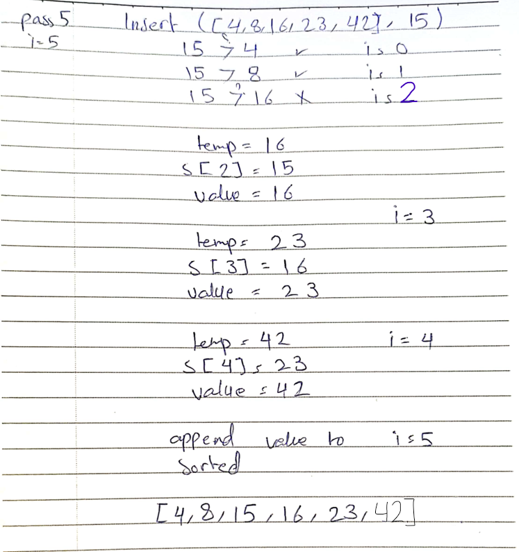
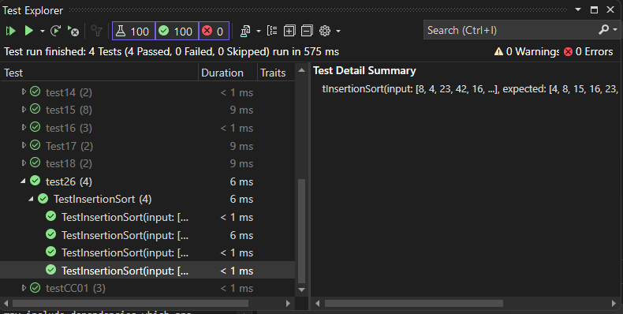

# Insertion Sort

Insertion sort is a simple and intuitive sorting algorithm that works by taking one element from the input array at a time and inserting it into the correct position in the sorted array.

## [Code](../data-structures-and-algorithms/Sorting/CC26.cs)

```csharp
 public void Insert(int[] sorted, int value,int sizeOfSorted)
        {
            int i = 0;
            while (i < sizeOfSorted && value > sorted[i])
            {
                i++;
            }
            while (i < sizeOfSorted)
            {
                int temp = sorted[i];
                sorted[i] = value;
                value = temp;
                i++;
            }
            sorted[sizeOfSorted] = value;
        }

        public int[] InsertionSort(int[] input)
        {
            int[] sorted = new int[input.Length];
            sorted[0] = input[0];
            for (int i = 1; i < input.Length; i++)
            {
                Insert(sorted, input[i],i);
            }
            return sorted;
        }
```

## Trace

*Sample Array: [8,4,23,42,16,15]*

- started with the InsertionSort function, which takes the input array [8,4,23,42,16,15] as a parameter and creates a new empty array called sorted. It then assigns the first element of the input array, which is 8, to the sorted array and starts a for loop from the second element of the input array, which is 4, to the last one, which is 15
	
- The Insert function starts by initializing a variable i to zero and a variable value to the element to be inserted. For example, in the first iteration, it sets i to 0 and value to 4. It then uses a while loop to compare the value with the elements in the sorted array from left to right and find the first element that is larger than or equal to the value. It increments i by one in each iteration of the while loop until it finds such an element or reaches the end of the sorted array. 

- Once it finds the right position to insert the value, it uses another while loop to shift the elements in the sorted array from right to left to make room for the value. 







## [Unit Testing](../CodeChallengesTests/test26.cs)





