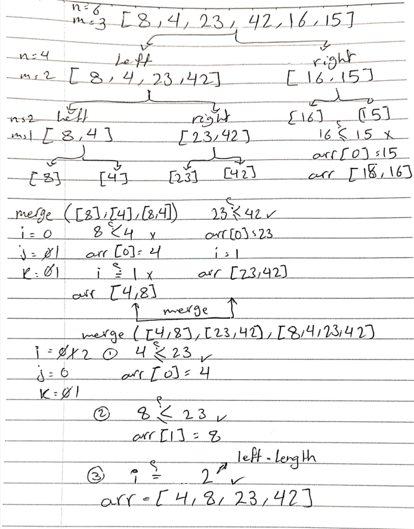
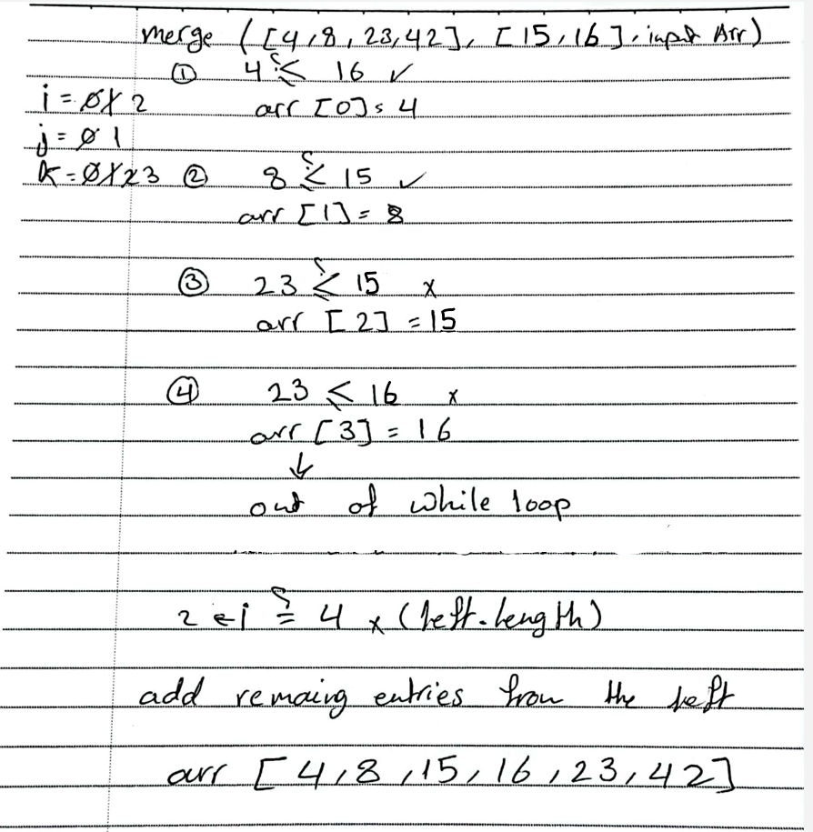
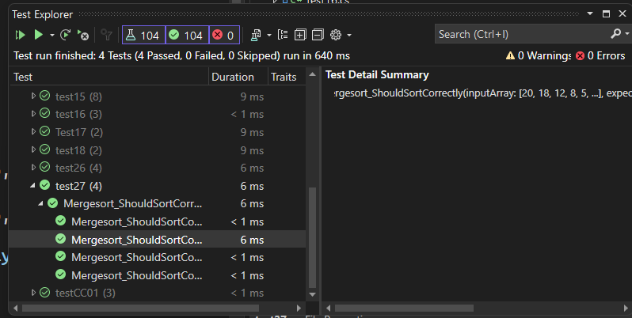

# Merge Sort

Merge Sort is a reliable and efficient sorting algorithm that uses a divide-and-conquer strategy to sort an array by dividing it into smaller subarrays, sorting those subarrays, and then merging them back together.

## [Code](../data-structures-and-algorithms/Sorting/CC27.cs)

```csharp
public void Mergesort(int[] arr)
        {
            int n = arr.Length;

            if (n > 1)
            {
                int mid = n / 2;
                int[] left = new int[mid];
                int[] right = new int[n - mid];

                for (int i = 0; i < mid; i++)
                {
                    left[i] = arr[i];
                }
                for (int i = mid; i < n; i++)
                {
                    right[i - mid] = arr[i];
                }

                Mergesort(left);
                Mergesort(right);

                Merge(left, right, arr);
            }
        }
        public void Merge(int[] left, int[] right, int[] arr)
        {
            int i = 0;
            int j = 0;
            int k = 0;
            while (i < left.Length && j < right.Length)
            {
                if (left[i] <= right[j])
                {
                    arr[k] = left[i];
                    i++;
                }
                else
                {
                    arr[k] = right[j];
                    j++;
                }
                k++;
            }

            while (i < left.Length)
            {
                arr[k] = left[i];
                i++;
                k++;
            }

            while (j < right.Length)
            {
                arr[k] = right[j];
                j++;
                k++;
            }
        }
```

## Trace

*Sample Array: [8,4,23,42,16,15]*

The process is splitting the array, sorting the subarrays, and then merging them back together. 	



- Last merge 

    

## Efficency

- Time: O(n log n)

because the array is repeatedly divided into halves, and each division takes logarithmic time. 
- Space: O(n)
 

    from the need to create temporary arrays during the merging step
## [Unit Testing](../CodeChallengesTests/test27.cs)





