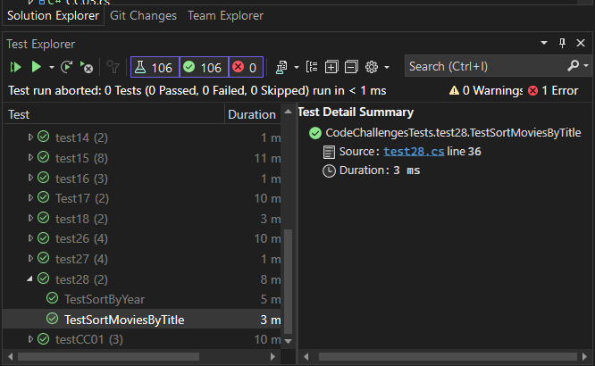

# Sorting:Comparisons

## Code Overview

The code consists of two main parts: the `Movie` class and the `MovieComparators` class.

### Movie Class

The `Movie` class represents a movie with the following properties:
- `Title`: A string representing the title of the movie.
- `Year`: An integer representing the year the movie was released.
- `Genres`: A list of strings representing the genres of the movie.

### MovieComparators Class

The `MovieComparators` class contains methods to sort a list of movies:
- `SortByYear`: This method sorts the movies by year in descending order.
- `SortByTitle`: This method sorts the movies by title in ascending order, ignoring leading articles ("A", "An", "The").

## [Code](../data-structures-and-algorithms/Sorting/CC28.cs)

## [Unit Testing](../CodeChallengesTests/test28.cs)

