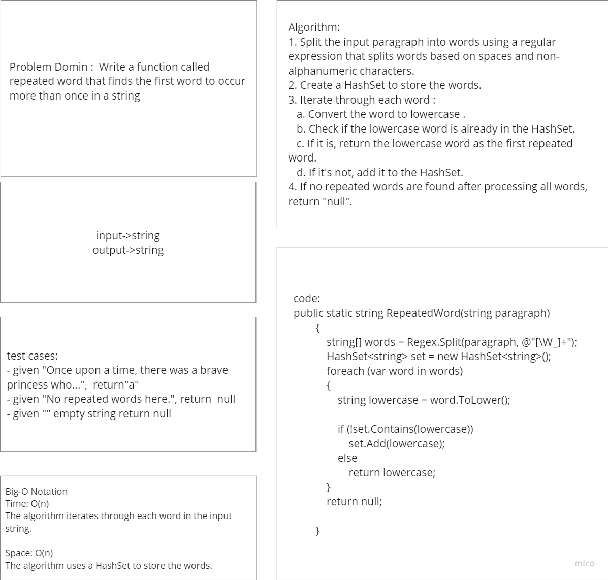

# Hashmap Repeated Word

The code implements a method, `RepeatedWord`, that efficiently finds the first repeated word in a given paragraph by splitting the text into words and using a HashSet for tracking encountered words. It returns the first repeated word or `null` if none are found.
## Whitboard 

## [Code](../data-structures-and-algorithms/CC31.cs)

## [Unit Test](../CodeChallengesTests/test31.cs)

