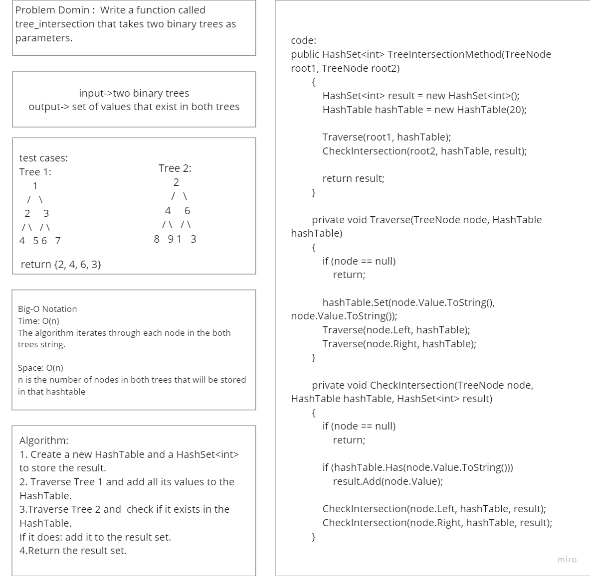
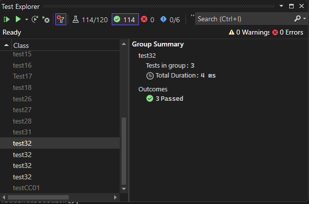

# Tree Intersection

The code implements ` TreeIntersection `class that finds the common values of two binary trees.

## Whitboard 

## [Code](../data-structures-and-algorithms/TreeIntersection.cs)

## [Unit Test](../CodeChallengesTests/test32.cs)

