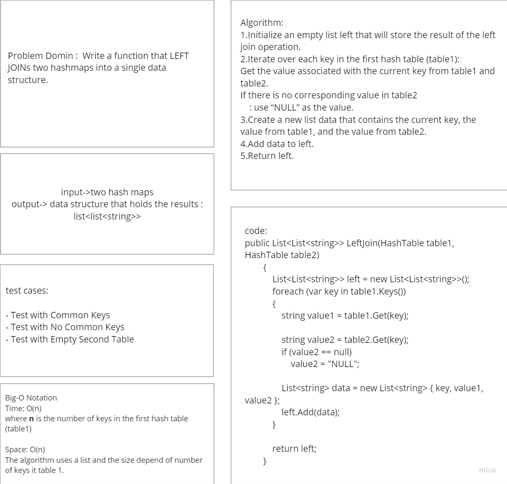
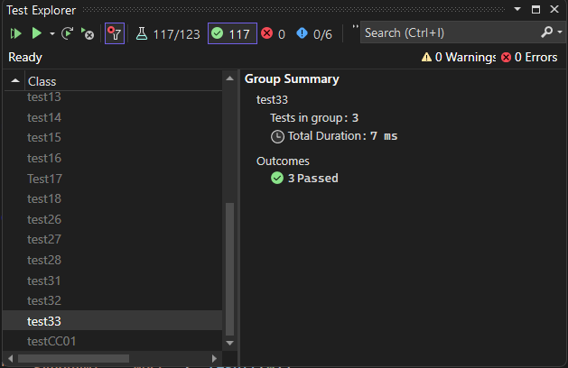

# Hashmap left join

The code implements ` Left Join ` method that represent left join operation on two hash tables

## Whitboard 

## [Code](../data-structures-and-algorithms/CC33.cs)

## [Unit Test](../CodeChallengesTests/test33.cs)

