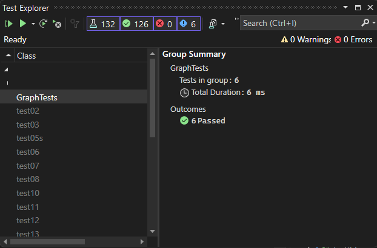

# Graph Implementation

## Overview

This Graph implementation is a data structure that allows you to store and retrieve vertices and edges efficiently. 

### Key Features

- **Add Vertex**: Add a vertex to the graph.
- **Add Edge**: Add an edge between two vertices in the graph.
- **Get Vertices**: Retrieve all of the vertices in the graph as a collection.
- **Get Neighbors**: Retrieve a collection of edges connected to a given vertex.
- **Size**: Returns the total number of vertices in the graph.
- **Contains**: Check if a vertex exists in the graph.

## [Code](../data-structures-and-algorithms/CC35.cs)

## [Unit Testing](../CodeChallengesTests/test35.cs)

The tests were written to prove the following functionality:

1. A vertex can be successfully added to the graph.
2. An edge can be successfully added to the graph.
3. A collection of all vertices can be properly retrieved from the graph.
4. All appropriate neighbors can be retrieved from the graph.
5. Neighbors are returned with the weight between vertices included.
6. The proper size is returned, representing the number of vertices in the graph.
7. A graph with only one vertex and edge can be properly returned.

