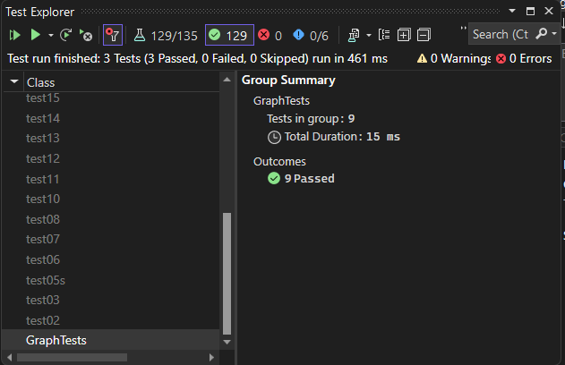

# Graph Breadth First

## Overview
The Breadth-First Search (BFS) is a graph traversal algorithm that explores nodes in a graph in breadthward motion.

## [Code](../data-structures-and-algorithms/Graph.cs)

Here's the implementation of the `BreadthFirst` method in the `Graph` class:

```csharp
public List<Vertex<T>> BreadthFirst(Vertex<T> node)
{
    Queue<Vertex<T>> queue = new Queue<Vertex<T>>();
    List<Vertex<T>> visited = new List<Vertex<T>>();
    queue.Enqueue(node);
    while (queue.Count > 0)
    {
        Vertex<T> nodeToAdd = queue.Peek();
        visited.Add(nodeToAdd);
        foreach (var item in AdjacenceyList[nodeToAdd])
        {
            if (!visited.Contains(item.Vertex))
            {
                queue.Enqueue(item.Vertex);
            }
        }
        queue.Dequeue();
    }
    return visited;
}
```

## Time and Space Complexity
The time complexity => **O(V + E)**
This is because each vertex and each edge will be explored only once during the traversal.

The space complexity => **O(V)**, as in the worst-case scenario, all vertices will be inserted into the queue. This happens when all vertices are connected in a linear fashion

## [Unit Testing](../CodeChallengesTests/test35.cs)

the test cases that were written:

1. `TestBreadthFirst_ReturnsCorrectOrder`
2. `TestBreadthFirst_ReturnsEmptyListForIsolatedNode`
3. `TestBreadthFirst_ThrowsExceptionForNonExistentNode`


