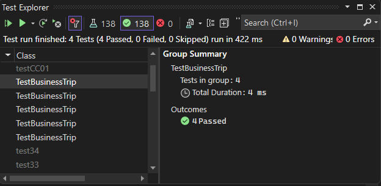

# Graph Business Trip

The code implements a function named `BusinessTrip` that calculates the total cost of a business trip given a graph of cities and an array of cities representing the itinerary.
## Whitboard 

## [Code](../data-structures-and-algorithms/CC37.cs)

## [Unit Test](../CodeChallengesTests/test37.cs)

