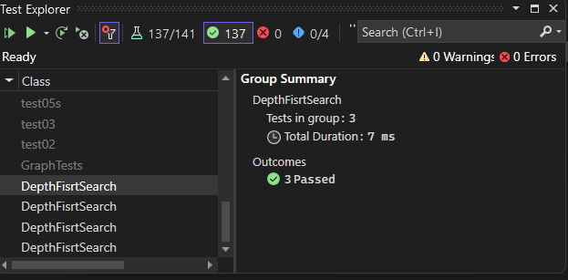

# Graph Depth-First Search

## Overview
The Depth-First Search (DFS) is a graph traversal algorithm that explores nodes in a graph in depthward motion. It uses a Stack to keep track of vertices to visit, and a HashSet to keep track of visited vertices.

## [Code](../data-structures-and-algorithms/Graph.cs)

Here's the implementation of the `DepthFirst` method in the `Graph` class:

```csharp
 public List<Vertex<T>> DepthFirst(Vertex<T> node)
        {
            Stack<Vertex<T>> stack = new Stack<Vertex<T>>();
            List<Vertex<T>> visited = new List<Vertex<T>>();
            HashSet<Vertex<T>> visitedSet = new HashSet<Vertex<T>>();

            stack.Push(node);

            while (stack.Count > 0)
            {
                Vertex<T> current = stack.Pop();

                if (!visitedSet.Contains(current))
                {
                    visited.Add(current);
                    visitedSet.Add(current);

                    foreach (var edge in AdjacenceyList[current])
                    {
                        if (!visitedSet.Contains(edge.Vertex))
                        {
                            stack.Push(edge.Vertex);
                        }
                    }
                }
            }

            return visited;
        }
```

## Time and Space Complexity
The time complexity => **O(V + E)**
This is because each vertex and each edge will be explored only once during the traversal.

The space complexity => **O(V)**, as in the worst-case scenario, all vertices will be inserted into the stack. This happens when all vertices are connected in a linear fashion

## [Unit Testing](../CodeChallengesTests/test38.cs)

The test cases that will be written:

1. single-node graph
2. linear (one-dimensional) graph
3. two-dimensional graph

